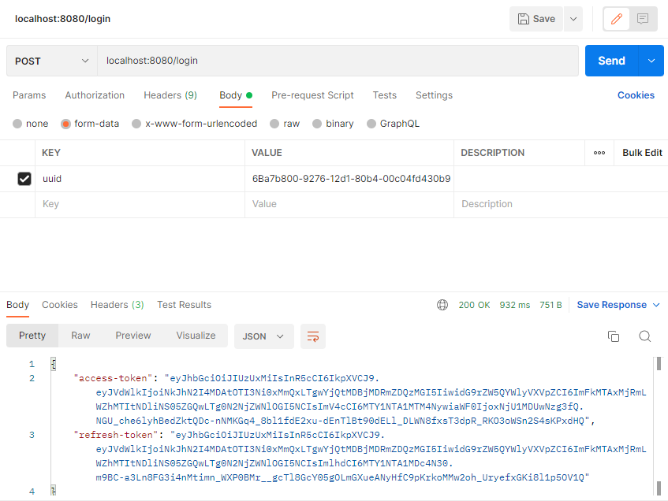
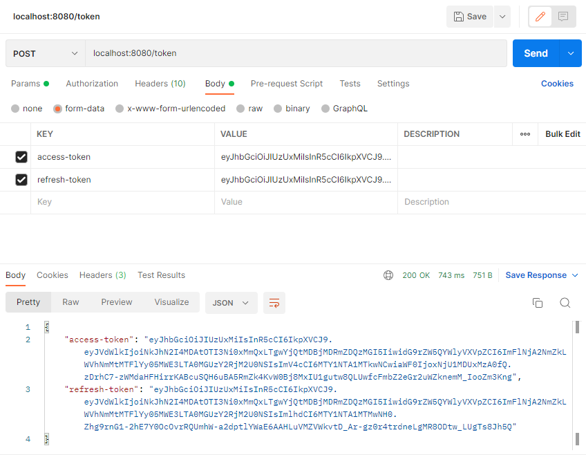

# MEDODS-interview
JWT authentication service

## Про маршруты

### /login
POST /login

Принимает как аргумент только правильный uuid\

Возвращает access и refresh токены и сообщение об ошибке в случае неудачи

**Request:** 
`POST /login ` 
`{ "uuid" : <user-uuid>}`

**Response:** 
`200` 
`{  "access-token" : <access-token>,
"refresh-token" : <refresh-token> }`

### /token

POST /login

Принимает как аргумент только правильный uuid\

Возвращает access и refresh токены и сообщение об ошибке в случае неудачи

**Request:** 
`POST /token ` 
`{  "access-token" : <access-token>,
    "refresh-token" : <refresh-token> }`

**Response:** 
`200` 
`{  "access-token" : <access-token>,
"refresh-token" : <refresh-token> }`

## Про URI для подключения к MongoDB
В .env находится переменная MONGO_URI для подключения к своему кластеру.
